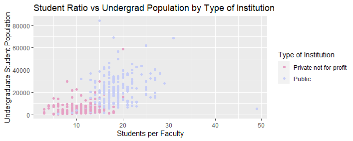
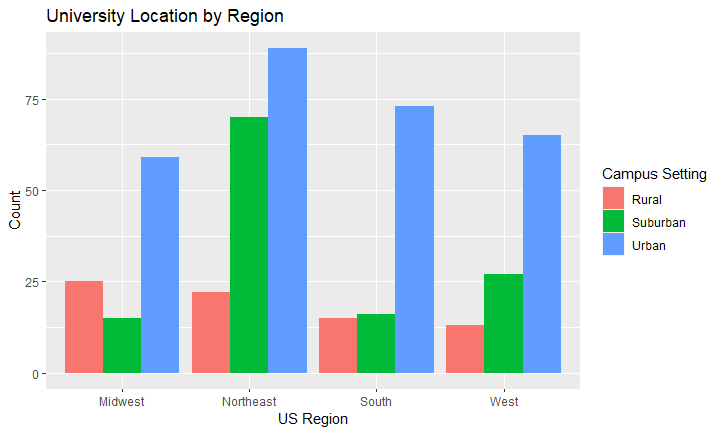
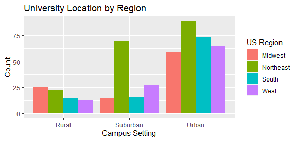

1. Using the `Teams` data frame in the Lahman package:

a) (10 points) Make a line plot of total home runs per season and stratify by league. Do you see anything interesting that you observe throughout the years? Create the same plot with changing years axis.

b) (10 points) Create an indicator variable called "winning record" which is defined as TRUE if the number of wins is greater than the number of losses and FALSE otherwise. Plot a scatter plot of Runs (R) vs Runs against (RA) with the color of each point showing whether that team had a winning record or not.

c) (5 points) Create a scatterplot of strikeouts (SO) vs walks (BB) faceting by Rank 1-5. What do you see? 

d) (10 points) Create a categorical variable with 4 levels: before 1900, 1900-1949, 1950-1999, 2000 or later. (Hint: There is a function called 'cut' that will help you here.) Use this as the color of the point in the scatterplot of strikeouts vs walks that you created in the previous problem. Now what do you see?

2. Using the `flights` data frame in the nycflight13 package:

a) (5 points) Create a histogram of the departure delays times (dep_delay) for all flights that had a delay time greater than 0.

b) (5 points) Repeat the same histogram, but now facet by month. 

c) (10 points) Create side-by-side boxplots of delay times for flights with if a flight was scheduled to leave before noon or afternoon (use 1200 for the time) for the top 5 airlines (in terms of number of flights).

3. Using `top_colleges_2022` recreate these images.

a) using the wes anderson pallet "GrandBudapest2".

b) Create these two plots and report what stands out from each one.

